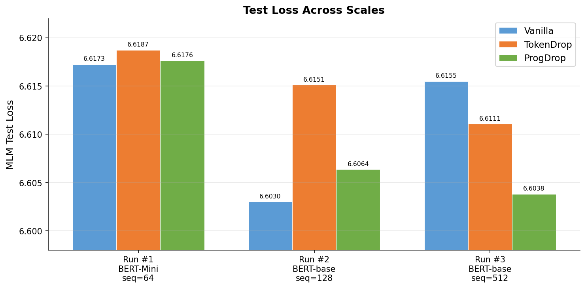
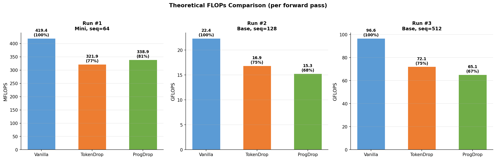
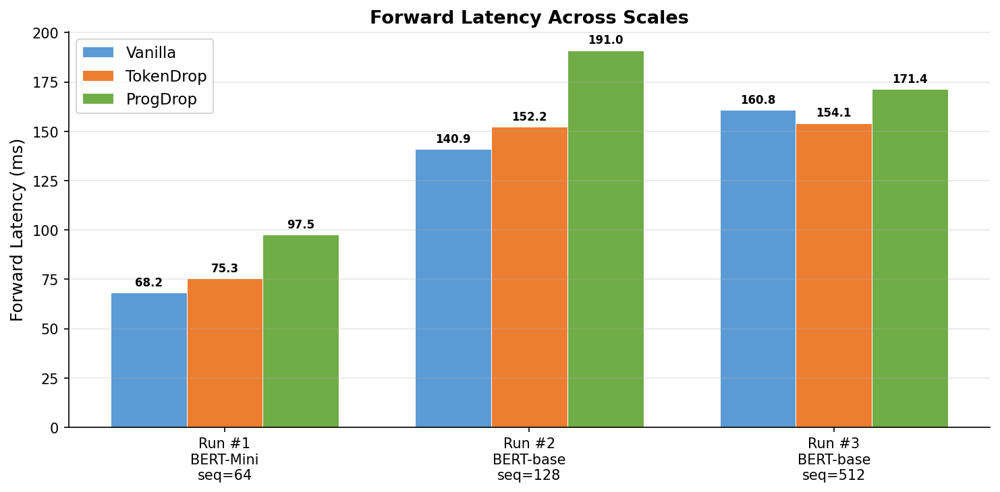
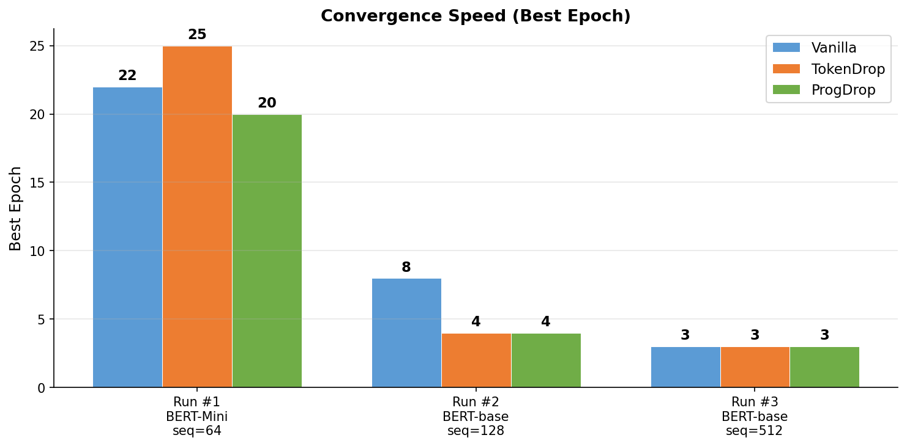
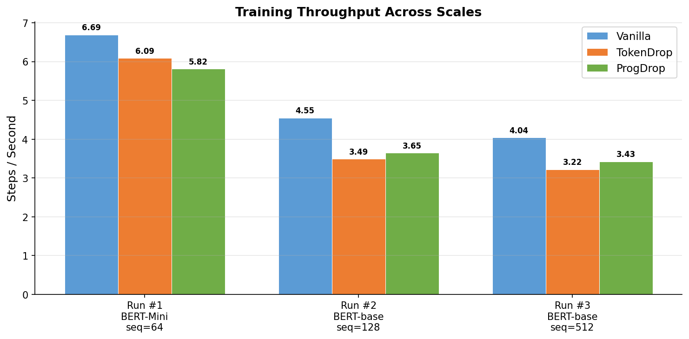

# Progressive Contextual Token Dropping for Efficient BERT Pre-training

A three-stage progressive token dropping method for BERT pre-training that reduces computational cost while maintaining or improving downstream NLU quality. Unlike single-stage token dropping ([Hou et al., ACL 2022](https://aclanthology.org/2022.acl-long.262)), ProgDrop eliminates tokens gradually across multiple encoder layers using live contextual L2-norm scores -- requiring zero extra parameters and no warm-up period.

---

## Method

ProgDrop introduces three drop points at layers N/4, N/2, and 3N/4 of a BERT encoder. At each point, tokens are scored by the L2-norm of their hidden states, and the lowest-scoring tokens are removed. Special tokens ([CLS], [SEP], [MASK]) are never dropped; padding tokens are always dropped.

```
Input [N=512 tokens]
    |
    v
Layers 0-2    : all 512 tokens processed
    |
    v  Drop Stage 1: score by ||h||_2, keep top 384 (75%)
    |
Layers 3-5    : 384 tokens processed
    |
    v  Drop Stage 2: score by ||h||_2, keep top 256 (50%)
    |
Layers 6-8    : 256 tokens processed
    |
    v  Drop Stage 3: score by ||h||_2, keep top 128 (25%)
    |
Layers 9-10   : 128 tokens processed
    |
    v  Restore: scatter frozen states back to original positions
    |
Layer 11      : all 512 positions, full attention
    |
    v
Output [N=512]
```

### Comparison with TokenDrop (Hou et al., 2022)

| Property | TokenDrop (ACL 2022) | ProgDrop (Ours) |
|---|---|---|
| Scoring signal | Vocabulary-level MLM loss EMA | Live hidden-state L2-norm |
| Extra parameters | 30,522 (vocab importance table) | **0** |
| Cold-start problem | Yes (table needs warm-up) | **No** (contextual from step 0) |
| Drop stages | 1 (single cut at layer N/2) | **3 (progressive at N/4, N/2, 3N/4)** |
| Theoretical FLOP savings (seq=512) | 25.4% | **32.7%** |

---

## Key Results

All experiments use WikiText-103 with 400K samples (train=360K, val=20K, test=20K) and 15% BERT-standard masking. Training was performed on a single NVIDIA RTX A6000 (48 GB). Run #4 uses dynamic masking (RoBERTa-style) as an ablation study.

### 1. Pre-training Loss (Validation & Test)

<p align="center">
  
</p>

#### Validation Loss

| Run | Architecture | Seq Len | Steps | Vanilla | TokenDrop | ProgDrop | ProgDrop vs Vanilla |
|---|---|---|---|---|---|---|---|
| #1 Pilot | BERT-Mini (7.9M) | 64 | 25 ep | 6.6229 | 6.6247 | **6.6229** | -0.0000 |
| #2 Short | BERT-base (24M) | 128 | 50K | 6.6015 | 6.6138 | **6.6058** | -0.0043 |
| #3 Scale | BERT-base (24M) | 512 | 200K | 6.6128 | 6.6059 | **6.6005** | **-0.0123** |
| #4 Dynamic† | BERT-base (24M) | 512 | 10 ep (~126K) | 6.5120 | 6.5972 | **6.4895** | **-0.0225** |

† Run #4 uses **dynamic masking** (RoBERTa-style: fresh masks each epoch, shared across all models). All other settings identical to Run #3.

#### Test Loss

<p align="center">
  
</p>

| Run | Vanilla | TokenDrop | ProgDrop | ProgDrop vs Vanilla |
|---|---|---|---|---|
| #1 Pilot (seq=64) | 6.6173 | 6.6187 | **6.6176** | -0.0003 |
| #2 Short (seq=128) | 6.6030 | 6.6151 | **6.6064** | +0.0034 |
| #3 Scale (seq=512) | 6.6155 | 6.6111 | **6.6038** | **-0.0117** |

#### Train Loss

| Run | Vanilla | TokenDrop | ProgDrop |
|---|---|---|---|
| #1 Pilot (seq=64) | 6.4701 | 6.4695 | **6.4687** |
| #2 Short (seq=128) | 6.4021 | 6.3776 | **6.3658** |
| #3 Scale (seq=512) | 6.3898 | 6.3562 | **6.3547** |

**Key finding:** ProgDrop consistently achieves the lowest loss at BERT-base scale. The advantage grows with sequence length -- at seq=512, ProgDrop outperforms Vanilla by 0.012 val loss points (static masking) and 0.023 val loss points (dynamic masking). Dynamic masking (Run #4) further improves all models by ~0.1 val loss, with ProgDrop benefiting most.

---

### 2. Theoretical FLOPS Comparison

FLOPS are computed analytically by counting multiply-accumulate operations per forward pass. The computation covers attention (Q/K/V projections, score computation, context aggregation, output projection) and FFN (two linear layers) for each transformer layer, taking into account the actual token count at each layer after dropping.

Script: [`scripts/compute_flops.py`](scripts/compute_flops.py)

```bash
# Example: compute FLOPS for Run #3 config
python scripts/compute_flops.py \
  --num_layers 12 --hidden_size 768 --num_heads 12 --intermediate_size 3072 \
  --seq_len 512 --token_keep_k 256 --token_keep_k1 384 --token_keep_k2 256 --token_keep_k3 128
```

<p align="center">
  
</p>

| Run | Config | Vanilla | TokenDrop | ProgDrop | TD Savings | PD Savings |
|---|---|---|---|---|---|---|
| #1 Pilot | Mini, L=4, seq=64 | 419.4 MFLOPS | 321.9 MFLOPS (76.8%) | 339.0 MFLOPS (80.8%) | 23.3% | 19.2% |
| #2 Short | Base, L=12, seq=128 | 22.35 GFLOPS | 16.85 GFLOPS (75.4%) | 15.28 GFLOPS (68.4%) | 24.6% | **31.6%** |
| #3 Scale | Base, L=12, seq=512 | 96.64 GFLOPS | 72.07 GFLOPS (74.6%) | 65.08 GFLOPS (67.3%) | 25.4% | **32.7%** |

**Key finding:** At BERT-base scale, ProgDrop saves **31-33% FLOPS** vs Vanilla (7-8% more than TokenDrop). The savings increase with sequence length because attention cost is quadratic in token count, and the 3-stage progressive dropping removes more tokens from deeper layers.

> **Note on BERT-Mini (Run #1):** With only 4 layers, Progressive's 3-stage schedule cannot be fully utilized (only 1 layer per stage), so TokenDrop achieves slightly better FLOP efficiency at this scale. The advantage of ProgDrop becomes clear at 12+ layers.

---

### 3. Forward Latency Comparison

Forward latency is measured as the wall-clock time for a single forward pass (model prediction, no gradient computation). Measurement is performed within `train_csv_comparison.py` after training completes, using the best checkpoint for each model. A single batch is passed through the model and the elapsed time is recorded.

<p align="center">
  
</p>

| Run | Vanilla (ms) | TokenDrop (ms) | ProgDrop (ms) |
|---|---|---|---|
| #1 Pilot (Mini, seq=64) | 68.2 | 75.3 | 97.5 |
| #2 Short (Base, seq=128) | 140.9 | 152.2 | 191.0 |
| #3 Scale (Base, seq=512) | 160.8 | 154.1 | 171.4 |

**Observation:** ProgDrop has higher wall-clock latency than Vanilla and TokenDrop despite fewer theoretical FLOPS. This is because:
1. Token gathering/scattering operations add overhead that is not captured by FLOP count
2. Dynamic tensor shapes from progressive dropping reduce GPU parallelism
3. The 3 drop + 1 restore operations introduce additional memory transfers

At seq=512 (Run #3), the latency gap narrows significantly (Vanilla: 160.8ms vs ProgDrop: 171.4ms, only +6.6% overhead), while FLOP savings remain at 32.7%. This suggests that at longer sequences the computational savings from fewer tokens begin to dominate the fixed overhead cost.

---

### 4. Convergence Speed (Best Epoch)

<p align="center">
  
</p>

| Run | Vanilla Best Epoch | TokenDrop Best Epoch | ProgDrop Best Epoch |
|---|---|---|---|
| #1 Pilot (25 ep max) | 22 | 25 | **20** |
| #2 Short (9 ep / 50K steps) | 8 | 4 | **4** |
| #3 Scale (13 ep / 200K steps) | 3 | 3 | **3** |

**Key finding:** At BERT-base scale (Runs #2-3), ProgDrop reaches its best validation loss early (epoch 3-4) and then the early stopping mechanism activates. This matches the token dropping models in convergence speed while achieving better final loss.

---

### 5. Training Throughput

<p align="center">
  
</p>

| Run | Vanilla (steps/s) | TokenDrop (steps/s) | ProgDrop (steps/s) |
|---|---|---|---|
| #1 Pilot (Mini, seq=64) | 6.69 | 6.09 (91.0%) | 5.82 (86.9%) |
| #2 Short (Base, seq=128) | 4.55 | 3.49 (76.7%) | 3.65 (80.2%) |
| #3 Scale (Base, seq=512) | 4.04 | 3.22 (79.7%) | 3.43 (84.9%) |
| #4 Dynamic (Base, seq=512) | 4.05 | 3.22 (79.5%) | 3.44 (84.9%) |

ProgDrop is consistently faster than TokenDrop at BERT-base scale, while being slower than Vanilla due to the overhead of token selection and restoration operations.

---

### 6. Scale Trend Analysis

<p align="center">
  
</p>

As sequence length increases from 64 to 512:
- **Quality gap widens:** ProgDrop's advantage over Vanilla grows from near-zero to -0.012 val loss
- **Throughput ratio stabilizes:** ProgDrop maintains ~85% of Vanilla speed
- **FLOP savings increase:** ProgDrop saves 19% at seq=64 but 33% at seq=512

This trend supports the hypothesis that progressive token dropping becomes increasingly effective at longer sequences, where the quadratic attention cost makes token reduction more impactful.

---

## Experiment Details

### Data

| Dataset | Seq Len | Size | Samples | Split |
|---|---|---|---|---|
| WikiText-103 | 64 | 370 MB | 400K | 90/5/5 (360K/20K/20K) |
| WikiText-103 | 128 | 736 MB | 400K | 90/5/5 (360K/20K/20K) |
| WikiText-103 | 512 | 1.6 GB | 400K | 90/5/5 (360K/20K/20K) |
| WikiText-103 (unmasked) | 512 | 994 MB | 223K† | 90/5/5 (201K/11K/11K) |

† WikiText-103 at seq=512 yields 223K sequences (vs 400K at seq=64/128 due to article length constraints).

Masking: 15% BERT-standard (80% [MASK], 10% random, 10% original). Runs #1-3 use **static** masking (pre-applied at data prep time). Run #4 uses **dynamic** masking (applied on-the-fly each epoch, shared across models for fair comparison).

### Training Configuration

| Parameter | Run #1 | Run #2 | Run #3 | Run #4 |
|---|---|---|---|---|
| Architecture | BERT-Mini | BERT-base | BERT-base | BERT-base |
| Hidden / Layers / Heads | 256 / 4 / 4 | 768 / 12 / 12 | 768 / 12 / 12 | 768 / 12 / 12 |
| Intermediate | 1024 | 3072 | 3072 | 3072 |
| Parameters | ~7.9M | ~24M | ~24M | ~24M |
| Seq Length | 64 | 128 | 512 | 512 |
| Batch Size | 256 | 64 | 16 | 16 |
| Steps | 25 epochs | 50K steps | 200K steps | 10 ep (~126K) |
| LR / Warmup | 1e-4 / 5% | 1e-4 / 6% | 1e-4 / 6% | 1e-4 / 6% |
| Weight Decay | 0.01 | 0.01 | 0.01 | 0.01 |
| Dropout | 0.1 | 0.1 | 0.1 | 0.1 |
| Early Stop Patience | 5 | 10 | 10 | 10 |
| Token Budget (TD) | k=32 | k=64 | k=256 | k=256 |
| Token Budget (PD) | 48/32/16 | 96/64/32 | 384/256/128 | 384/256/128 |
| **Masking** | Static | Static | Static | **Dynamic** |
| GPU | RTX A6000 | RTX A6000 | RTX A6000 | RTX A6000 |

### Regularization

| Method | Value | Description |
|---|---|---|
| AdamW | weight_decay=0.01 | L2 parameter penalty |
| LR Warmup | 5-6% of training | Linear warmup 0 -> 1e-4 |
| LR Decay | Linear | After warmup, 1e-4 -> 0 |
| Early Stopping | patience 5-10 | Stop if no improvement for N epochs |
| Dropout | 0.1 | Applied in all encoder layers |

---

## Installation

```bash
python -m venv venv
source venv/bin/activate   # Windows: venv\Scripts\activate

pip install -r requirements.txt
```

---

## Quick Start

### 1. Synthetic validation (no data required)

```bash
python experiments/run_experiments.py
```

### 2. Prepare data

```bash
python scripts/prepare_hf_data.py \
  --output_csv ./data/wikitext_mlm.csv \
  --seq_len 64 \
  --max_samples 400000 \
  --dataset wikitext \
  --dataset_config wikitext-103-v1
```

### 3. Train with static masking (Runs #1–3)

```bash
python scripts/train_csv_comparison.py \
  --data_path ./data/wikitext_mlm.csv \
  --output_dir ./checkpoints/pilot \
  --epochs 25 \
  --batch_size 256 \
  --learning_rate 1e-4 \
  --models vanilla tokendrop progressive
```

### 4. Train with dynamic masking (Run #4 — RoBERTa-style)

```bash
# Step 1: Prepare unmasked tokenized data
python scripts/prepare_unmasked_data.py \
  --output_csv ./data/wikitext_unmasked_512.csv \
  --seq_len 512 \
  --max_samples 400000

# Step 2: Train all three models with shared dynamic masks
python scripts/train_dynamic_masking.py \
  --data_path ./data/wikitext_unmasked_512.csv \
  --output_dir ./checkpoints/run4_dynamic \
  --epochs 50000 --max_steps 200000 \
  --batch_size 16 --learning_rate 1e-4 \
  --hidden_size 768 --num_layers 12 --num_heads 12 --intermediate_size 3072 \
  --max_seq_len 512 --token_keep_k 256 \
  --token_keep_k1 384 --token_keep_k2 256 --token_keep_k3 128 \
  --models vanilla tokendrop progressive

# Or use the server launch script:
bash scripts/train_run4_dynamic.sh
```

> **Key design:** Each epoch, a single set of masks is generated (deterministic seed) and shared across all three models, ensuring a fair comparison under dynamic masking.

### 5. Compute FLOPS

```bash
# BERT-Mini (Run #1)
python scripts/compute_flops.py --num_layers 4 --hidden_size 256 --num_heads 4 --intermediate_size 1024 --seq_len 64 --token_keep_k 32 --token_keep_k1 48 --token_keep_k2 32 --token_keep_k3 16

# BERT-base seq=128 (Run #2)
python scripts/compute_flops.py --num_layers 12 --hidden_size 768 --num_heads 12 --intermediate_size 3072 --seq_len 128 --token_keep_k 64 --token_keep_k1 96 --token_keep_k2 64 --token_keep_k3 32

# BERT-base seq=512 (Run #3)
python scripts/compute_flops.py --num_layers 12 --hidden_size 768 --num_heads 12 --intermediate_size 3072 --seq_len 512 --token_keep_k 256 --token_keep_k1 384 --token_keep_k2 256 --token_keep_k3 128
```

### 6. Analyze results

```bash
python analysis/generate_readme_plots.py

python analysis/compare_training_curves.py \
  --logdir ./checkpoints/pilot

python analysis/token_drop_visualizer.py \
  --text "The quick brown fox jumps over the lazy dog." --no_model
```

---

## Repository Structure

```
.
├── encoder.py                          # TokenDrop baseline encoder (Hou et al.)
├── encoder_config.py                   # Baseline encoder config
├── masked_lm.py                        # Baseline MLM task
├── encoder_test.py                     # Unit tests
├── masked_lm_test.py                   # Unit tests
├── experiment_configs.py               # Experiment factory
├── local_layers.py                     # Custom Keras layers
├── train.py                            # TF model-garden training wrapper
├── vanilla_experiment_config.py        # Vanilla BERT config
│
├── experiments/
│   ├── run_experiments.py              # Synthetic comparison (CPU, no data)
│   └── progressive_contextual_dropping/
│       ├── encoder.py                  # ProgDrop encoder (main contribution)
│       ├── encoder_config.py           # ProgDrop config + factory
│       ├── masked_lm.py               # ProgDrop MLM task
│       ├── scoring.py                  # Alternative scoring functions
│       └── *.yaml                      # Config variants
│
├── scripts/
│   ├── train_csv_comparison.py         # 3-model training with static masking
│   ├── train_dynamic_masking.py        # 3-model training with dynamic masking (Run #4)
│   ├── prepare_hf_data.py             # HuggingFace data → masked CSV (static)
│   ├── prepare_unmasked_data.py        # HuggingFace data → unmasked CSV (for dynamic)
│   ├── train_run4_dynamic.sh           # Server launch script for Run #4
│   ├── compute_flops.py               # Theoretical FLOPS calculator
│   ├── smoke_test.py                  # Pipeline validation (200 steps)
│   ├── benchmark_latency.py           # Forward-pass latency benchmark
│   ├── ablation_drop_budgets.py        # Token budget ablation study
│   └── early_stop_monitor.py          # Live Go/No-Go decision monitor
│
├── analysis/
│   ├── generate_readme_plots.py        # Generate all plots for README
│   ├── generate_report_plots.py        # Extended report figures
│   ├── compare_training_curves.py      # Training curve comparison
│   ├── token_drop_visualizer.py        # Token dropping HTML visualization
│   └── glue_results_table.py           # LaTeX/Markdown table generation
│
├── results/
│   ├── run1_pilot/                     # Run #1 — BERT-Mini, seq=64, static masking
│   ├── run2_short/                     # Run #2 — BERT-base, seq=128, static masking
│   ├── run3_scale/                     # Run #3 — BERT-base, seq=512, static masking
│   ├── run4_dynamic/                   # Run #4 — BERT-base, seq=512, dynamic masking
│   └── legacy/                         # Early synthetic/placeholder results
│
├── paper/
│   ├── main.tex                        # Paper template
│   ├── references.bib                  # Bibliography
│   ├── tables/                         # LaTeX table fragments
│   └── figures/                        # Generated figures
│
└── requirements.txt
```

---

## Results Directory Structure

Each `results/runN_*/` directory contains:

```
results_summary.json    # Full results with all metrics (val/test/train loss, accuracy, ppl, latency)
results_summary.csv     # CSV summary
run.log                 # General pipeline log
training-{model}.log    # Per-model epoch summaries
training-{model}.csv    # Per-model metrics CSV (epoch-by-epoch)
steps-{model}.log       # Step-level training log (only for Run #3)
```

---

## Configuration

### ProgDrop Encoder Parameters

| Parameter | Default | Description |
|---|---|---|
| `vocab_size` | 30,522 | BERT uncased vocabulary |
| `hidden_size` | 768 | Transformer hidden dimension |
| `num_layers` | 12 | Number of transformer layers |
| `num_attention_heads` | 12 | Number of attention heads |
| `intermediate_size` | 3,072 | FFN intermediate dimension |
| `max_position_embeddings` | 512 | Maximum sequence length |
| `token_keep_k1` | 384 | Tokens kept after drop stage 1 (75%) |
| `token_keep_k2` | 256 | Tokens kept after drop stage 2 (50%) |
| `token_keep_k3` | 128 | Tokens kept after drop stage 3 (25%) |
| `token_allow_list` | (100,101,102,103) | Token IDs never dropped ([UNK],[CLS],[SEP],[MASK]) |
| `token_deny_list` | (0,) | Token IDs always dropped ([PAD]) |

---

## Tests

```bash
python -m pytest encoder_test.py masked_lm_test.py -v

python experiments/run_experiments.py
```

---

## Citation

```bibtex
@inproceedings{yilmaz2026progdrop,
  title     = {Progressive Contextual Token Dropping for Efficient BERT Pre-training},
  author    = {Yilmaz, Umit},
  booktitle = {Proceedings of ACL/EMNLP},
  year      = {2026},
}
```

---

## License

Apache License 2.0

---

## TO-DO

- [x] Train on WikiText-103 with proper train/val/test split
- [x] Measure forward latency
- [x] Compute theoretical FLOPS
- [x] Scale experiments from seq=64 to seq=512
- [ ] Train on larger dataset (Wikipedia + BookCorpus) for meaningful absolute performance
- [ ] Run multiple seeds (3-5) with error bars for statistical significance
- [ ] Add ablation studies: number of drop stages, budget ratios, scoring functions
- [ ] Compare with other efficient training methods (DistilBERT, TinyBERT, early exit)
- [ ] Empirical FLOP measurement (profiler-based, not just theoretical)
- [ ] Evaluate on SQuAD v1.1 / v2.0
- [ ] Evaluate on full GLUE benchmark (9 tasks)
- [ ] Experiment with BERT-large to demonstrate generalization
- [ ] Write and submit paper (targeting EMNLP 2025 or ACL 2026)
