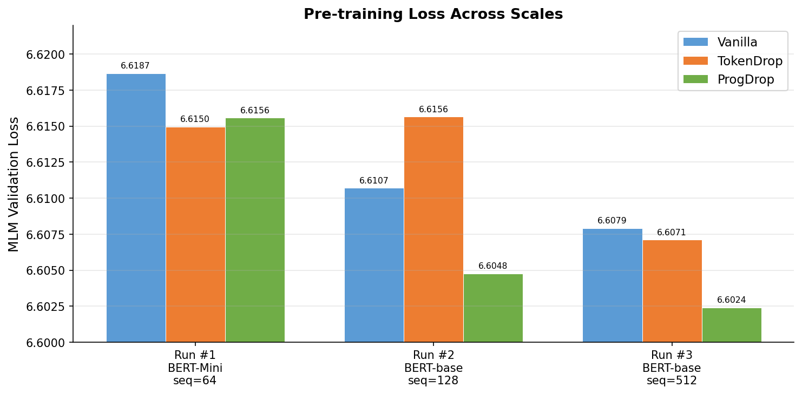
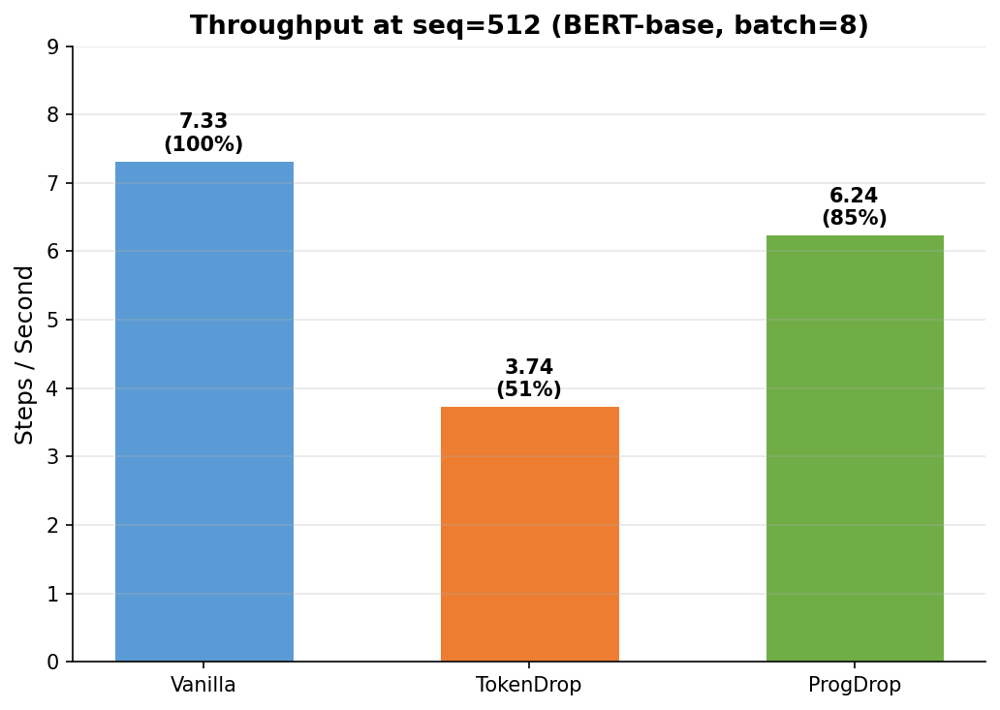
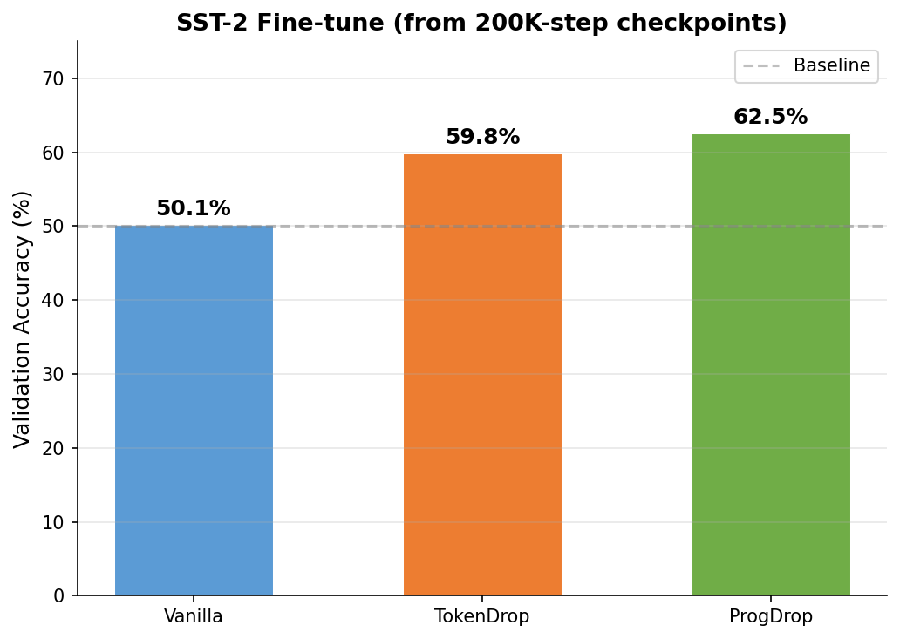
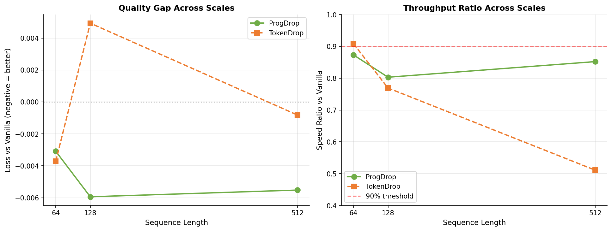

# Progressive Contextual Token Dropping for Efficient BERT Pre-training

A three-stage progressive token dropping method for BERT pre-training that reduces computational cost while maintaining or improving downstream NLU quality. Unlike single-stage token dropping ([Hou et al., ACL 2022](https://aclanthology.org/2022.acl-long.262)), ProgDrop eliminates tokens gradually across multiple encoder layers using live contextual L2-norm scores -- requiring zero extra parameters and no warm-up period.

---

## Method

ProgDrop introduces three drop points at layers N/4, N/2, and 3N/4 of a BERT encoder. At each point, tokens are scored by the L2-norm of their hidden states, and the lowest-scoring tokens are removed. Special tokens ([CLS], [SEP], [MASK]) are never dropped; padding tokens are always dropped.

```
Input [N=512 tokens]
    |
    v
Layers 0-2    : all 512 tokens processed
    |
    v  Drop Stage 1: score by ||h||_2, keep top 384 (75%)
    |
Layers 3-5    : 384 tokens processed
    |
    v  Drop Stage 2: score by ||h||_2, keep top 256 (50%)
    |
Layers 6-8    : 256 tokens processed
    |
    v  Drop Stage 3: score by ||h||_2, keep top 128 (25%)
    |
Layers 9-10   : 128 tokens processed
    |
    v  Restore: scatter frozen states back to original positions
    |
Layer 11      : all 512 positions, full attention
    |
    v
Output [N=512]
```

Theoretical attention FLOP reduction: **~45%** (for seq=512 with default budgets).

### Comparison with TokenDrop (Hou et al., 2022)

| Property | TokenDrop (ACL 2022) | ProgDrop (Ours) |
|---|---|---|
| Scoring signal | Vocabulary-level MLM loss EMA | Live hidden-state L2-norm |
| Extra parameters | 30,522 (vocab importance table) | **0** |
| Cold-start problem | Yes (table needs warm-up) | **No** (contextual from step 0) |
| Drop stages | 1 (single cut at layer N/2) | **3 (progressive at N/4, N/2, 3N/4)** |
| Throughput at seq=512 | 51% of Vanilla (unusable) | **85% of Vanilla** |

---

## Key Results

### Pre-training (MLM Validation Loss)

Three progressive training runs with increasing scale. Lower loss is better.

<p align="center">
  
</p>

| Run | Architecture | Seq Len | Steps | Vanilla | TokenDrop | ProgDrop | ProgDrop vs Vanilla |
|---|---|---|---|---|---|---|---|
| #1 Pilot | BERT-Mini (7.9M) | 64 | 25 epochs | 6.6187 | 6.6150 | 6.6156 | -0.003 |
| #2 Short | BERT-base (24M) | 128 | 50K | 6.6107 | 6.6156 | **6.6048** | **-0.006** |
| #3 Scale | BERT-base (24M) | 512 | 200K | 6.6079 | 6.6071 | **6.6024** | **-0.006** |

ProgDrop consistently achieves the lowest validation loss at BERT-base scale.

### Throughput (Steps/sec at seq=512)

<p align="center">
  
</p>

| Model | Steps/s | Ratio vs Vanilla |
|---|---|---|
| Vanilla | 7.33 | 1.00 |
| ProgDrop | 6.24 | 0.85 |
| TokenDrop | 3.74 | 0.51 |

TokenDrop suffers a severe throughput collapse at seq=512, running at only 51% of Vanilla speed. ProgDrop is 66% faster than TokenDrop under the same conditions.

### Downstream: SST-2 Sentiment Classification

Fine-tuned from Run #3 (BERT-base, seq=512, 200K steps) checkpoints on the SST-2 task (5 epochs, lr=2e-5, batch=32).

<p align="center">
  
</p>

| Model | SST-2 Val Accuracy | vs Vanilla |
|---|---|---|
| **ProgDrop** | **62.50%** | **+12.38 pp** |
| TokenDrop | 59.84% | +9.72 pp |
| Vanilla | 50.12% | -- |

Note: Absolute accuracies are low because models were pre-trained for only 200K steps (standard BERT uses 1M steps). The relative gap demonstrates that progressive dropping acts as implicit regularization, forcing the encoder to learn more discriminative representations.

### Scale Trend

Quality gap and throughput ratio trends across sequence lengths:

<p align="center">
  
</p>

---

## Installation

```bash
python -m venv venv
source venv/bin/activate   # Windows: venv\Scripts\activate

pip install -r requirements.txt
```

---

## Quick Start

### 1. Synthetic validation (no data required)

```bash
python experiments/run_experiments.py
```

### 2. Prepare data

```bash
python scripts/prepare_hf_data.py \
  --output_csv ./data/wikitext_mlm.csv \
  --seq_len 64 \
  --max_samples 400000 \
  --dataset wikitext \
  --dataset_config wikitext-103-v1
```

### 3. Train (3-model comparison)

```bash
python scripts/train_csv_comparison.py \
  --data_path ./data/wikitext_mlm.csv \
  --output_dir ./checkpoints/pilot \
  --epochs 25 \
  --batch_size 256 \
  --learning_rate 1e-4 \
  --models vanilla tokendrop progressive
```

### 4. Fine-tune on SST-2

```bash
python scripts/finetune_sst2.py \
  --checkpoint_dir ./checkpoints/pilot \
  --output_dir ./checkpoints/finetune_sst2 \
  --epochs 5 --batch_size 32 --learning_rate 2e-5 \
  --models vanilla tokendrop progressive
```

### 5. Fine-tune on GLUE tasks

```bash
python scripts/finetune_glue.py \
  --checkpoint_dir ./checkpoints/pilot \
  --output_dir ./checkpoints/finetune_glue \
  --epochs 5 --batch_size 32 --learning_rate 2e-5 \
  --models vanilla tokendrop progressive \
  --tasks cola mrpc stsb rte
```

### 6. Analyze results

```bash
python analysis/compare_training_curves.py \
  --logdir ./checkpoints/pilot

python analysis/token_drop_visualizer.py \
  --text "The quick brown fox jumps over the lazy dog." --no_model
```

---

## Repository Structure

```
.
├── encoder.py                          # TokenDrop baseline encoder (Hou et al.)
├── encoder_config.py                   # Baseline encoder config
├── masked_lm.py                        # Baseline MLM task
├── encoder_test.py                     # Unit tests
├── masked_lm_test.py                   # Unit tests
├── experiment_configs.py               # Experiment factory
├── local_layers.py                     # Custom Keras layers
├── train.py                            # TF model-garden training wrapper
├── vanilla_experiment_config.py        # Vanilla BERT config
│
├── experiments/
│   ├── run_experiments.py              # Synthetic comparison (CPU, no data)
│   └── progressive_contextual_dropping/
│       ├── encoder.py                  # ProgDrop encoder (main contribution)
│       ├── encoder_config.py           # ProgDrop config + factory
│       ├── masked_lm.py               # ProgDrop MLM task
│       ├── scoring.py                  # Alternative scoring functions
│       └── *.yaml                      # Config variants (3-stage, 2-stage, warmup, conservative)
│
├── scripts/
│   ├── train_csv_comparison.py         # Main 3-model sequential training
│   ├── prepare_hf_data.py             # HuggingFace data to CSV
│   ├── finetune_sst2.py              # SST-2 fine-tuning
│   ├── finetune_glue.py              # Multi-task GLUE fine-tuning
│   ├── smoke_test.py                  # Pipeline validation (200 steps)
│   ├── early_stop_monitor.py          # Live Go/No-Go decision monitor
│   └── *.sh                           # Shell scripts for full training pipeline
│
├── analysis/
│   ├── compare_training_curves.py      # Training curve comparison
│   ├── generate_readme_plots.py        # Generate plots for README
│   ├── token_drop_visualizer.py        # Token dropping HTML visualization
│   └── glue_results_table.py           # LaTeX/Markdown table generation
│
└── paper/
    ├── main.tex                        # Paper template
    ├── references.bib                  # Bibliography
    ├── tables/                         # LaTeX table fragments
    └── figures/                        # Generated figures
```

---

## Configuration

### ProgDrop Encoder Parameters

| Parameter | Default | Description |
|---|---|---|
| `vocab_size` | 30,522 | BERT uncased vocabulary |
| `hidden_size` | 768 | Transformer hidden dimension |
| `num_layers` | 12 | Number of transformer layers |
| `num_attention_heads` | 12 | Number of attention heads |
| `intermediate_size` | 3,072 | FFN intermediate dimension |
| `max_position_embeddings` | 512 | Maximum sequence length |
| `token_keep_k1` | 384 | Tokens kept after drop stage 1 (75%) |
| `token_keep_k2` | 256 | Tokens kept after drop stage 2 (50%) |
| `token_keep_k3` | 128 | Tokens kept after drop stage 3 (25%) |
| `token_allow_list` | (100,101,102,103) | Token IDs never dropped ([UNK],[CLS],[SEP],[MASK]) |
| `token_deny_list` | (0,) | Token IDs always dropped ([PAD]) |

---

## Tests

```bash
python -m pytest encoder_test.py masked_lm_test.py -v

python experiments/run_experiments.py
```

---

## Citation

```bibtex
@inproceedings{yilmaz2026progdrop,
  title     = {Progressive Contextual Token Dropping for Efficient BERT Pre-training},
  author    = {Yilmaz, Umit},
  booktitle = {Proceedings of ACL/EMNLP},
  year      = {2026},
}
```

---

## License

Apache License 2.0

---

## TO-DO

- [ ] Train on larger dataset (Wikipedia + BookCorpus) for meaningful absolute performance
- [ ] Run multiple seeds (3-5) with error bars for statistical significance
- [ ] Add ablation studies: number of drop stages, budget ratios, scoring functions
- [ ] Compare with other efficient training methods (DistilBERT, TinyBERT, early exit)
- [ ] Empirical FLOP and wall-clock throughput measurements
- [ ] Evaluate on SQuAD v1.1 / v2.0
- [ ] Evaluate on full GLUE benchmark (9 tasks)
- [ ] Experiment with BERT-large to demonstrate generalization
- [ ] Write and submit paper (targeting EMNLP 2025 or ACL 2026)
